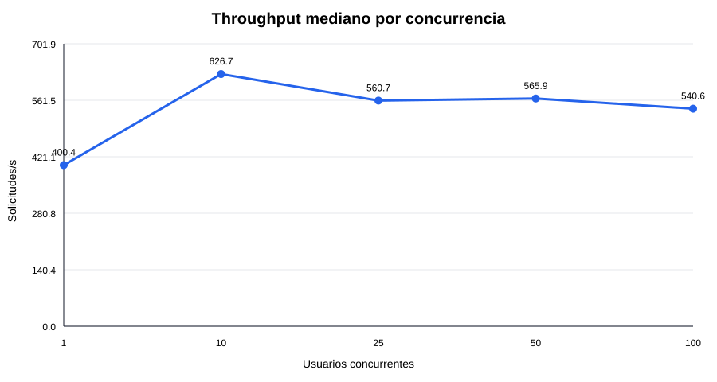
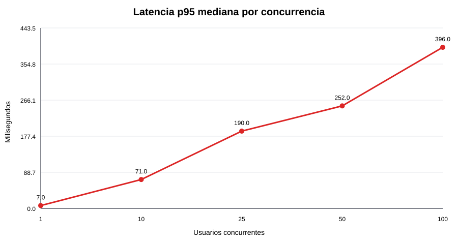
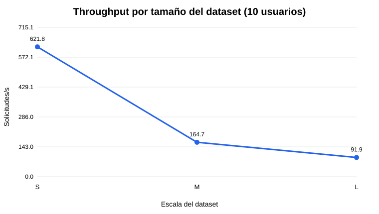
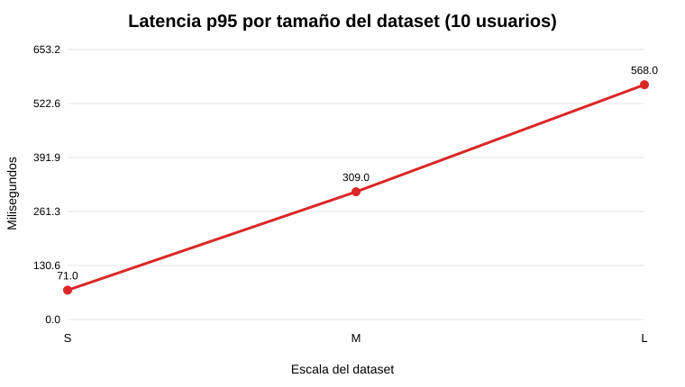

# Evaluación crítica de la arquitectura híbrida de Ecommify

**Maestría en Arquitectura de Software — Universidad de La Sabana**  
**Curso:** Diseño y optimización de bases de datos  
**Profesor:** Miguel Alfonso Varela Fonseca  
**Equipo:** Andrés Fernando Díaz Moreno, Carlos Alberto Arévalo Martínez, Luis Alfredo González Mercado y Andrés Camilo López Castro  
**Unidad 6 — Etapa 1 formativa**  
**Fecha:** junio de 2026

## Introducción

Ecommify es un marketplace multivendedor cuya arquitectura separa el núcleo transaccional en PostgreSQL de las proyecciones y cargas flexibles en MongoDB. PostgreSQL actúa como fuente de verdad para clientes, productos, órdenes, ítems, pagos, promociones e inventario lógico; MongoDB soporta el catálogo denormalizado, reseñas, eventos analíticos y sesiones.

El objetivo de esta evaluación es comprobar, mediante una metodología reproducible, el rendimiento y la escalabilidad de la implementación, comparar ambos motores según las cargas reales del negocio y revisar las decisiones arquitectónicas ante particiones de red y retrasos de replicación.

## 1. Metodología de evaluación

La suite propuesta combina nueve flujos: creación transaccional de órdenes, consulta de detalle, reportes mensuales, búsqueda geoespacial, lectura de catálogo, ingesta de eventos, manejo de sesiones, agregaciones analíticas y dashboard híbrido. Se probarán 1, 10, 25, 50 y 100 usuarios virtuales. Para aislar el efecto del volumen se mantendrán 10 usuarios sobre datasets de 10.000, 50.000 y 100.000 órdenes, equivalentes a una progresión 1x, 5x y 10x.

Cada combinación tendrá calentamiento, cinco repeticiones y 120 segundos de medición. Se reportarán throughput, p50, p95, p99, tasa de error y degradación respecto al baseline. El punto de quiebre será el primer nivel que incumpla el objetivo de latencia, supere 1 % de errores o deje de aumentar throughput al incrementar concurrencia.

La especificación completa está en `01_plan_pruebas.md`. Se ejecutaron 25 corridas formales de concurrencia —cinco repeticiones para 1, 10, 25, 50 y 100 usuarios— y nueve corridas para escalabilidad por volumen. Cada corrida duró 120 segundos con rampa de 10 segundos y restauración previa del estado dinámico.

En escala S, el throughput mediano aumentó de 400,39 ops/s con un usuario a un máximo de 626,68 ops/s con 10 usuarios. Con 25 usuarios disminuyó a 560,70 ops/s y p95 pasó de 71 a 190 ms. Con 100 usuarios el sistema mantuvo 0 % de errores, pero p95 llegó a 396 ms. El punto de saturación de la mezcla se encuentra entre 10 y 25 usuarios.

La prueba de volumen mantuvo 10 usuarios. Al crecer de S (10.000 órdenes y 100.000 eventos) a L (100.000 órdenes y 1.000.000 de eventos), throughput bajó de 621,83 a 91,94 ops/s y p95 aumentó de 71 a 568 ms. El detalle completo, las gráficas y las limitaciones están documentados en `06_resultados_pruebas.md`.

### Resultados de concurrencia

| Usuarios | Throughput | p50 | p95 | p99 | Errores |
|---:|---:|---:|---:|---:|---:|
| 1 | 400,39 ops/s | 1 ms | 7 ms | 11 ms | 0 % |
| 10 | 626,68 ops/s | 4 ms | 71 ms | 110 ms | 0 % |
| 25 | 560,70 ops/s | 16 ms | 190 ms | 268 ms | 0 % |
| 50 | 565,91 ops/s | 65 ms | 252 ms | 354 ms | 0 % |
| 100 | 540,56 ops/s | 172 ms | 396 ms | 525 ms | 0 % |

### Resultados de escalabilidad

| Escala | Órdenes | Productos | Eventos | Throughput | p95 | Errores |
|---|---:|---:|---:|---:|---:|---:|
| S — 1x | 10.000 | 5.000 | 100.000 | 621,83 ops/s | 71 ms | 0 % |
| M — 5x | 50.000 | 20.000 | 500.000 | 164,73 ops/s | 309 ms | 0 % |
| L — 10x | 100.000 | 40.000 | 1.000.000 | 91,94 ops/s | 568 ms | 0 % |

## 2. Evidencia disponible y limitaciones

Unidad 4 ejecutó diez consultas PostgreSQL con `EXPLAIN (ANALYZE, BUFFERS)`. Entre los resultados principales, la consulta mensual por categoría pasó de 3,076 ms a 0,693 ms al usar una vista materializada; la consulta geoespacial pasó de 187,922 ms a 116,412 ms; y la segmentación de clientes pasó de 0,493 ms a 0,208 ms. También se verificó partition pruning al consultar directamente rangos de fecha.

Estos datos comprueban que los scripts funcionan y permiten identificar la consulta espacial como cuello de botella, pero no representan un benchmark productivo: fueron obtenidos con pocos datos mock, sin usuarios concurrentes y sin una carga equivalente de MongoDB. Por rigor, no se extrapolan ni se usan para declarar un ganador global.

## 3. Comparación PostgreSQL vs. MongoDB

PostgreSQL es la selección adecuada para órdenes y pagos porque concentra transacciones ACID, claves foráneas, restricciones, auditoría y consultas relacionales. También demostró que JSONB, arreglos y tipos compuestos cubren atributos flexibles sin abandonar la integridad del producto maestro.

MongoDB es una selección adecuada para catálogo denormalizado, sesiones con TTL, reseñas polimórficas y eventos agrupados en buckets, pero la prueba mostró que no debe combinar lecturas operativas y agregaciones completas sin preagregación. Con 10 usuarios en escala S, catálogo obtuvo p95 de 25 ms y escritura de eventos 14 ms; a 100 usuarios aumentaron a 309 y 304 ms. En contraste, el detalle indexado de orden en PostgreSQL mantuvo p95 de 27 ms con 100 usuarios. Estas cargas no son funcionalmente idénticas, por lo que evidencian comportamiento por módulo y no superioridad universal de un motor.

No se recomienda una arquitectura completamente NoSQL porque trasladaría integridad y consistencia financiera a la aplicación. Una arquitectura completamente relacional sí es viable y simplificaría la operación, pero expondría al mismo motor las cargas de sesiones, eventos y transacciones. La arquitectura híbrida se justifica si las pruebas confirman que esas ganancias compensan el costo de sincronización y operación de dos bases.

El dashboard que consulta ambos motores fue la operación más costosa: p95 pasó de 110 ms con 10 usuarios a 517 ms con 100. Esto confirma que el costo principal de la arquitectura híbrida no está en una lectura indexada individual, sino en coordinar y agregar información entre motores. La matriz completa está en `02_comparativo_postgresql_mongodb.md`.

| Aspecto | Ganador contextual | Justificación |
|---|---|---|
| Órdenes, pagos e inventario | PostgreSQL | ACID, FK, restricciones y auditoría; detalle de orden mantuvo p95 de 27 ms con 100 usuarios. |
| Catálogo denormalizado | MongoDB | Documento listo para frontend; p95 de 25 ms con 10 usuarios en S. |
| Eventos de comportamiento | MongoDB | Bucket pattern y desacoplamiento del OLTP; p95 de 14 ms con 10 usuarios en S. |
| Consultas relacionales y financieras | PostgreSQL | Joins, snapshots consistentes y vistas materializadas. |
| Flexibilidad de reseñas y sesiones | MongoDB | Documentos polimórficos y TTL nativo. |
| Dashboard cross-motor | Ninguno sin optimización | p95 de 517 ms con 100 usuarios; requiere preagregación. |
| Integridad y consistencia fuerte | PostgreSQL | Las referencias y reglas se expresan declarativamente. |
| Disponibilidad de proyecciones | MongoDB | Adecuado para servir datos eventualmente consistentes; requiere replica set para demostrar AP. |

## 4. Teorema CAP aplicado

Ecommify no tiene una única posición CAP. Durante una partición, órdenes, pagos, inventario y producto maestro priorizan consistencia y tolerancia a particiones: si no se puede confirmar el estado canónico, la operación se rechaza o queda pendiente. Catálogo, reseñas, eventos y sesiones priorizan disponibilidad y tolerancia a particiones: pueden operar con una ventana controlada de inconsistencia.

| Módulo | Política | Decisión durante partición |
|---|---|---|
| Órdenes, pagos e inventario | CP | Rechazar o diferir la operación antes que confirmar estados divergentes. |
| Producto maestro y promociones | CP | Conservar un único estado canónico en PostgreSQL. |
| Catálogo de lectura | AP | Servir una proyección posiblemente desactualizada y revalidar en checkout. |
| Reseñas y eventos | AP | Aceptar temporalmente retraso, duplicados mitigables o consistencia eventual. |
| Sesiones | AP | Priorizar continuidad; sesión y carrito son recuperables. |

Esta clasificación es una política arquitectónica, no una propiedad automática de PostgreSQL o MongoDB. Para demostrar tolerancia real es necesario probar una topología distribuida; los contenedores locales de nodo único solo validan funcionalidad.

El mayor riesgo es la proyección `product_catalog`. Con el ETL académico cada seis horas, un precio podría permanecer obsoleto durante casi seis horas más reintentos. La mitigación obligatoria es validar precio, promoción e inventario en PostgreSQL al hacer checkout. En producción se recomienda CDC, orden por `source_updated_at`, escrituras idempotentes y monitoreo del lag extremo a extremo.

## 5. Escenarios críticos

En Black Friday se prioriza la disponibilidad de navegación: MongoDB y caché pueden servir catálogo eventualmente consistente, mientras PostgreSQL conserva consistencia estricta para comprar. En checkout se sacrifica disponibilidad antes que confirmar una orden o pago divergente. En auditoría financiera se acepta demorar el reporte hasta obtener un snapshot consistente y conciliado.

Esta separación permite degradación parcial: una caída de MongoDB no debe invalidar el núcleo financiero y una caída de PostgreSQL no debe impedir navegar, aunque sí debe impedir confirmar compras.

## 6. Cuellos de botella y recomendaciones iniciales

1. El dashboard híbrido debe usar preagregaciones diarias o vistas materializadas; escanear todos los eventos provocó la mayor degradación por volumen.
2. La consulta geoespacial identificada en Unidad 4 sigue requiriendo límite de radio, revisión del índice GiST y caché por zona.
3. Las vistas materializadas mejoran reportes, pero requieren una política explícita de refresco y medición de frescura.
4. El catálogo necesita un SLO de lag; seis horas no son aceptables para precio y stock en producción.
5. El checkout debe publicar proyecciones desde el outbox de forma asíncrona para desacoplar su latencia de MongoDB.
6. La ingesta de eventos debe controlar tamaño del bucket, duplicados y presión de índices.

## Conclusión

La asignación tecnológica es coherente con los requisitos de Ecommify: PostgreSQL protege el núcleo transaccional y MongoDB desacopla cargas flexibles. Las pruebas confirmaron que las operaciones indexadas permanecen estables, pero la arquitectura alcanza saturación entre 10 y 25 usuarios para la mezcla evaluada y se degrada cuando el dashboard agrega todos los eventos. La solución híbrida se mantiene, condicionada a preagregación analítica, procesamiento asíncrono del outbox, caché de catálogo y monitoreo del lag. Las 31 corridas distintas finalizaron sin errores y dejan evidencia reproducible para sustentar estas decisiones.

## Referencias

- Brewer, E. (2012). *CAP twelve years later: How the rules have changed*. Computer, 45(2), 23–29.
- Gilbert, S., & Lynch, N. (2002). Brewer's conjecture and the feasibility of consistent, available, partition-tolerant web services. *ACM SIGACT News, 33*(2), 51–59.
- MongoDB, Inc. (2025). *MongoDB Manual: Replication, read concern and write concern*.
- PostgreSQL Global Development Group. (2025). *PostgreSQL 16 Documentation: Concurrency control, partitioning and EXPLAIN*.
- Ecommify. (2026). *Unidad 4: Documentación de ejecución y resultados de optimización* [Documento interno del proyecto].
